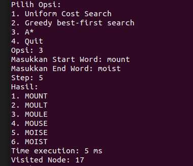

# Tucil03_STIMA
> Mencari Solusi Optimal Permainan Word Ladder Menggunakan Algoritma UCS, Greedy-BFS, dan A*

## Table of Contents
* [General Information](#general-information)
* [Features](#Features)
* [Technology Used](#technoogy-used)
* [Screenshots](#screenshots)
* [Setup](#setup)
* [Usage](#usage)
* [Room for Improvement](#room-for-improvement)
* [Profile](#profile)
## General Information
Word Ladder atau permainan tangga kata (juga dikenal sebagai Doublets, tautan kata, teka-teki ubah-kata, paragrams, tangga kata, atau golf kata) adalah permainan kata yang diciptakan oleh Lewis Carroll. Teka-teki tangga kata dimulai dengan dua kata, dan untuk memecahkan teka-teki tersebut seseorang harus menemukan rangkaian kata lain untuk menghubungkan kedua kata tersebut, di mana dua kata berturut-turut (itu adalah, kata-kata dalam langkah-langkah yang berhasil) berbeda satu huruf.

## Features
- Implementasi Parsing dictionary
- Desain Struktur Data Tree
- Implementasi UCS
- Implementasi Greedy-BFS
- Implementasi A*
- Kalkulasi waktu algortima
- Jumlah Node yang Dikunjungi
## Technoogy Used
* Java - version 20.0.2
* Java Compiler (javac) - version 20.0.2
## Screenshots

## Setup
    1. Install java
    2. Clone Repository as Below
    git clone https://github.com/AlbertGhazaly/Tucil3_13522150
## Usage
    --Parse to Get Dictionary (Optional)--
    javac data/Parse.java
    Java data/Parse

    --Compile MainProgram--
    cd src
    javac MainProgram.java
    java MainProgram
## Room for Improvement
### Room for Improvement:
* I/O file
* GUI
### To-do:
* Input from .txt file feature
* Output to .txt file feature
* Create GUI implementation using appropriate java libraries
## Profile
* Nama: Albert Ghazaly
* NIM: 13522150
* Kelas: K03
* Cita-Cita: Masuk Surga
* Hobi: Mancing dan Kulineran
